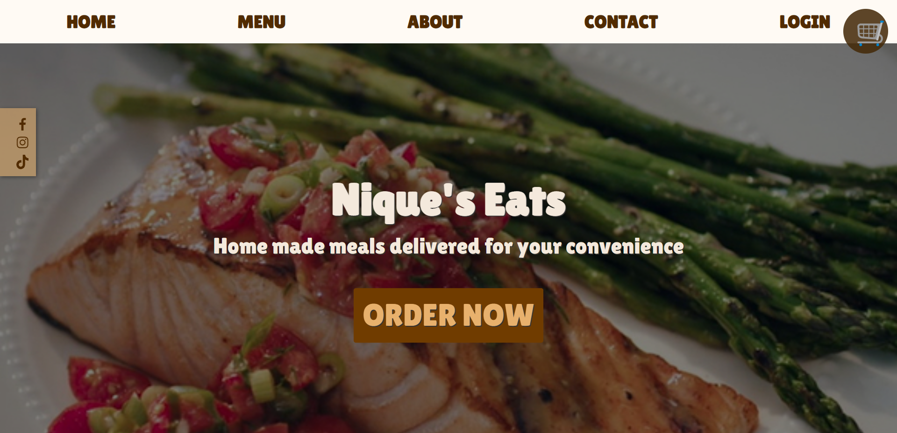
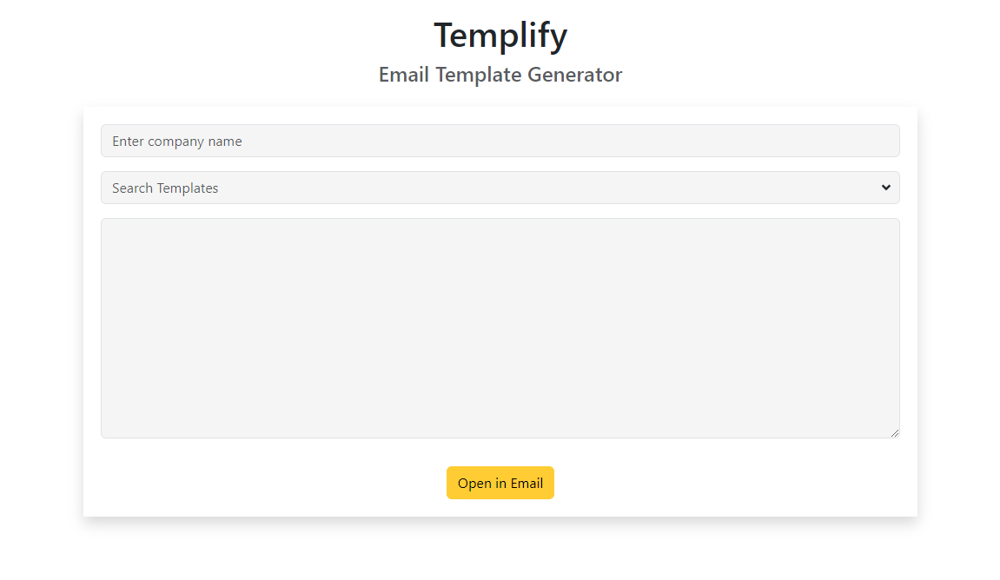
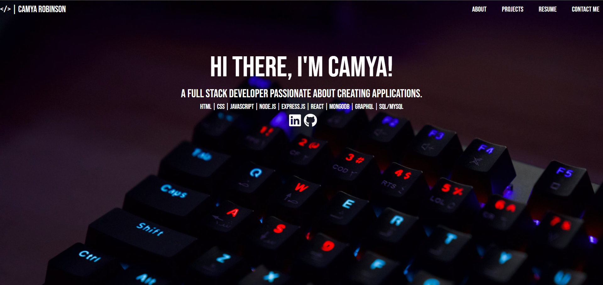

<!------------------------------------------------------SOCIAL LINKS------------------------------------------------------------>

  
  
  

Full Stack Software Engineer dedicated to learning, growth, and building products that help others.

<!------------------------------------------------------PROJECTS------------------------------------------------------------>
<h1 align="center">Projects</h1>
<table bordercolor="#66b2b2">

  <tr>
    <!------------------------------------------------------PROJECT 1------------------------------------------------------------>
    <td width="50%" valign="top">
      <h3 align="center">Nique's Eats</h3>
         
        
         
        

  
  
      

        
<strong>React, Bootstrap, MongoDB, Node.js, & Express.js</strong> - A meal delivery service app that delivers homemade meals
            to customers on their date of choice. This ecommerce full-stack
            application utilizes the MERN stack.

    </td>
    <!------------------------------------------------------PROJECT 2------------------------------------------------------------>
        <td width="50%" valign="top">
      <h3 align="center">Templify</h3>
       
        
       
        

  
  
      

        
<strong>React, Bootstrap</strong> - An application that allows users to select from a variety of pre-designed templates, 
          customize them to their liking, and generate an email with a subject line ready for use.

    </td>
  </tr>

  <tr>
        <!------------------------------------------------------PROJECT 3------------------------------------------------------------>
        <td width="50%" valign="top">
      <h3 align="center">camyacodes portfolio</h3>
         
      
         
        

  
  
      

        
<strong>React, Bootstrap</strong> - Portfolio Site explaining a bit about myself and my coding projects.

    </td>
    <!------------------------------------------------------PROJECT 4------------------------------------------------------------>
      <td width="50%" valign="top">
      <h3 align="center">Team Profile Generator</h3>
         
        
         
        

  
  
      

        
<strong>HTML5, CSS3, Javascript, Bootstrap</strong> - A Node.js command-line application that takes in information about
            employees on a software engineering team and generates a webpage
            that displays summaries for each person.

    </td>
  </tr>
</table>

<h1 align="center">Technologies</h1>

    
    
    
    
    
    
    
    
    
    
    

