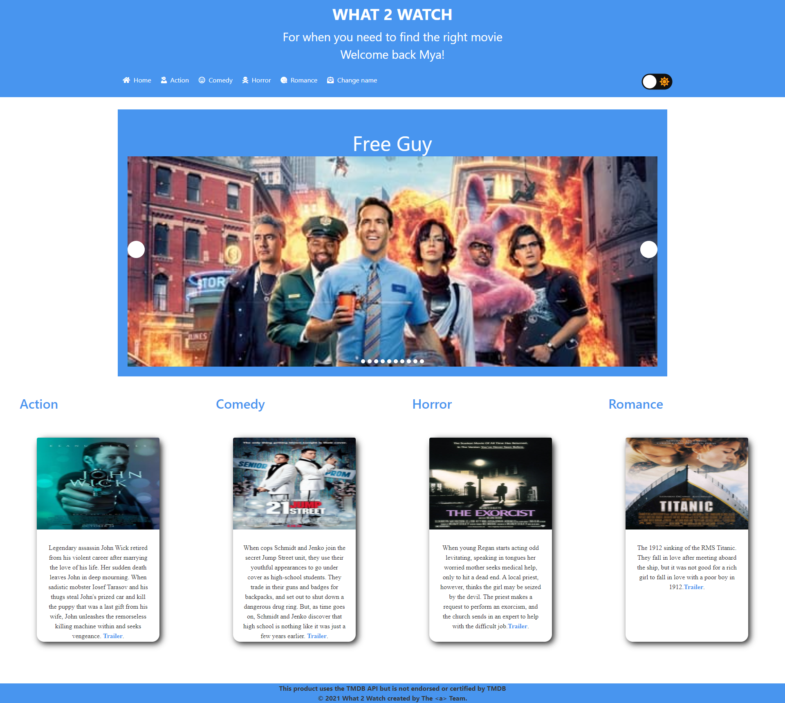

  
  
  
<!--    -->
<!--    -->

Full Stack Software Engineer, I am motivated by the power of technology as a tool for positive change, with a background in data analysis.

See [my website](https://camyacodes.github.io/camyarobinson) for more information!

<h1 align="center">Projects</h1>
<table bordercolor="#66b2b2">

  <tr>
    <td width="50%" valign="top">
      <h3 align="center">Nique's Eats</h3>
         
        
         
        

  
  
      

        
<strong>React, Bootstrap, MongoDB, Node.js, & Express.js</strong> - A meal delivery service app that delivers homemade meals
            to customers on their date of choice. This ecommerce full-stack
            application utilizes the MERN stack.

    </td>
    <td width="50%" valign="top">
      <h3 align="center">CamyaCodes.com</h3>
         
      
         
        

  
  
      

        
<strong>React, Bootstrap</strong> - Portfolio Site including links to my projects and ways to get in contact with me.

    </td>
  </tr>

  <tr>
    <td width="50%" valign="top">
      <h3 align="center">What 2 Watch</h3>
       
        
       
        

  
  
      

        
<strong>HTML5, CSS3, & Javascript</strong> - An application that provides users the experience of finding movies
            in a more convenient way, by providing popular movie titles sorted
            by genre all on one site.

    </td>
    <td width="50%" valign="top">
      <h3 align="center">Team Profile Generator</h3>
         
        
         
        

  
  
      

        
<strong>HTML5, CSS3, Javascript, Bootstrap</strong> - A Node.js command-line application that takes in information about
            employees on a software engineering team and generates a webpage
            that displays summaries for each person.

    </td>
  </tr>
</table>

<h1 align="center">Technologies</h1>

    
    
<!--      -->
    
    
    
<!--      -->
    
<!--      -->
<!--      -->
<!--     
     -->
<!--      -->
    
    
    
<!--      -->
<!--      -->
    
    
  
<!--      -->

---

<h1 align="center">Connect</h1>

  
  
  
<!--    -->
<!--    -->

<!---
camyacodes/camyacodes is a ✨ special ✨ repository because its `README.md` (this file) appears on your GitHub profile.
You can click the Preview link to take a look at your changes.
--->
